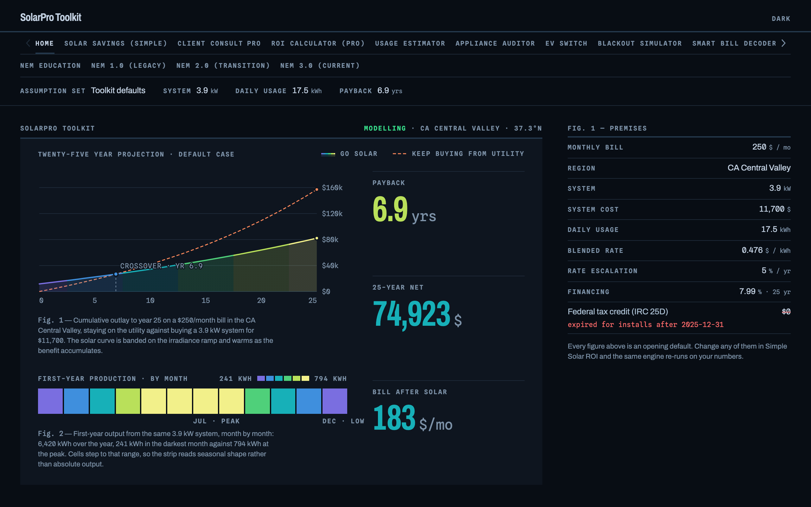
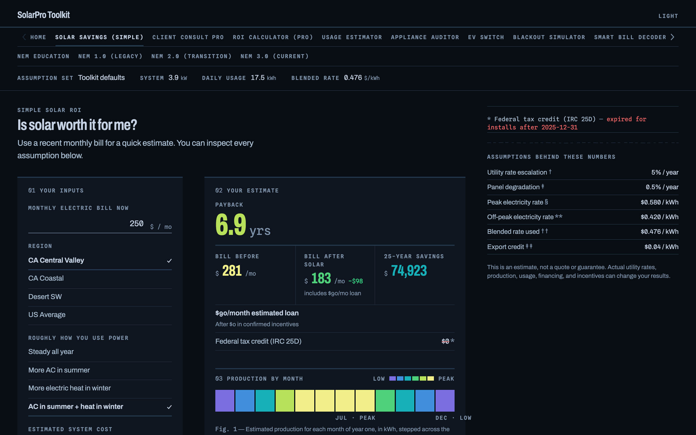
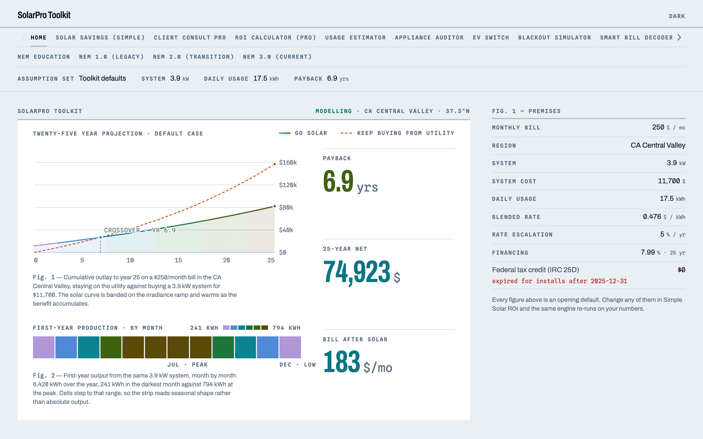

# SolarPro Toolkit

Free solar, battery, and EV calculators that run entirely in your browser.

**[Open the app](https://aiden0rchad.github.io/solar-toolkit/)**. No signup, no tracking. Nothing you type leaves your machine.

[](https://aiden0rchad.github.io/solar-toolkit/)

It runs in dark or light, following your system by default. Everything you see is real output from the same engine the calculators use, computed in your browser as the page loads.

| | |
|---|---|
|  |  |

Most solar calculators online are lead generators. They exist to make solar look good so you'll leave your phone number. This one is just the math. Sometimes the math says yes, sometimes it says keep your money, and I think a calculator should be fine with either answer.

If this tool helps you, please consider donating. I'm a university student and the job market is really bad right now, so every bit genuinely helps.

<a href="https://www.buymeacoffee.com/aiden0rchad" target="_blank"></a>

## Start with your question

- [Is solar worth it for me?](https://aiden0rchad.github.io/solar-toolkit/#/simple-roi) Type in your monthly bill and get payback years, your new bill, and 25 year savings.
- [Will a battery keep my lights on?](https://aiden0rchad.github.io/solar-toolkit/#/blackout) Pick what needs to stay running and see how long it actually lasts.
- [Should I switch to an EV?](https://aiden0rchad.github.io/solar-toolkit/#/ev) Compare real monthly costs against your current car, loan and all.

## Why this calculator doesn't lie to you

It won't pretend the federal tax credit still exists. The 30% residential credit (IRC 25D) ended for systems installed after December 31, 2025, and plenty of calculators still quietly bake it in. Here incentives default to zero, and you only add programs you have actually confirmed.

It models winter. Production is calculated month by month, and a Central Valley December makes less than a third of what July makes. The results show that instead of hiding it behind an annual average.

The battery follows physics. It only discharges what solar surplus actually stored, after round trip losses, depth of discharge limits, and yearly degradation. No free energy.

Billing is the ugly real kind. Time of use rates, a NEM 3.0 style export credit that pays you almost nothing, fixed charges solar can't remove, and properly amortized loan payments.

And every result comes with an "assumptions behind these numbers" panel, so you can see exactly what the model believed when it did the math.

Defaults are California flavored (TOU rates, NEM 3.0, CA climate profiles), but every number is editable.

## The free tools

| Tool | What it answers |
|---|---|
| **Solar Savings (Simple)** | Bill in, payback out. Same engine as the full calculator, just fewer knobs. |
| **Blackout Simulator** | How long a battery really runs your fridge, wifi, or CPAP. |
| **EV Switch** | EV versus your current car, with a built in vehicle database. |
| **Usage Estimator** | Rough out your home's kWh when you don't have a bill handy. |
| **Appliance Auditor** | Add up future loads like an EV or a pool pump before sizing anything. |
| **Smart Bill Decoder** | Which parts of your bill solar removes, and which parts it can't touch. |
| **NEM 1.0 / 2.0 / 3.0 explainers** | What changed, hour by hour, with the rates charted and every term defined. |

<a id="pro"></a>

## The Pro version (not ready yet)

Pro is the same math with the lid off, aimed at people who do solar for a living rather than people working out one house.

**You can see it before it exists.** Open [Client Consult](https://aiden0rchad.github.io/solar-toolkit/#/consult), [ROI Calculator](https://aiden0rchad.github.io/solar-toolkit/#/calculator) or [Proposal Generator](https://aiden0rchad.github.io/solar-toolkit/#/proposal) in the free app and each one shows you a worked preview: the full control surface, a specimen of the output, and the case it was computed from. Those numbers are real. They come out of the same engine in this repository that every free tool runs on, computed in your browser as the page loads, not screenshotted from somewhere.

Three tools:

- **Client Consult Wizard.** A six step interview you run at the kitchen table. Client, bill, usage, system, financing, result. The payback recomputes between questions, so the client watches the number move when they tell you their real bill.
- **ROI Calculator (Pro).** Every knob exposed. Full tariff control, real battery physics (depth of discharge, reserve floor, round trip efficiency, degradation), retrofits over an existing loan or a PPA with its escalator, and 25 years modelled month by month.
- **Proposal Generator.** All of it assembled into one printable document on your letterhead, carrying the assumptions page with it. That page is the part that wins arguments six months later.

I'm still building it and there is nothing to buy yet. If you clicked an Upgrade button in the app and landed here, that's why. Watch or star the repo and you'll know the moment that changes.

When it launches, a Pro subscription will also be how you get the commercial license this project requires for work use.

## Hire me for a consult

If you'd rather have someone walk you through your own numbers, that's something I do.

**$50 for a one hour session.** We go through your actual bill and usage, work out whether solar makes sense for your house at all, talk through which installers in your area are worth quoting, and you get a proposal PDF at the end with the numbers written down. Then a short second session once you've had time to sit with it, to go over the results and look over any quotes you've collected.

The reason this is worth $50 is that the alternative is free. A salesperson from a large national installer will happily spend an hour with you too, but they're paid on commission and they only sell one product, so the answer is decided before they arrive. I don't sell panels and I don't take referral fees from installers, which means "don't do this yet" and "your usage is too low to justify a battery" are both answers I'm allowed to give you. Over 25 years that's usually worth a great deal more than the fifty dollars.

Get in touch:

- **[lycsweb.com](https://lycsweb.com)** is the front door
- Or [open an issue](../../issues) on this repo if you'd rather do it in public

## Run it yourself

Prebuilt images for amd64 and arm64 are published to GHCR on every push:

```bash
docker run -p 8080:80 ghcr.io/aiden0rchad/solar-toolkit:latest
```

Or build it locally with `docker build -t solar-toolkit .` if you prefer. The app makes zero external requests (even the font is self hosted), so it keeps working offline once it loads.

## Development

The feedback roadmap adds saved inputs with an optional device setting, panel-count/wattage sizing, energy-offset targets, editable regional assumptions, and an itemized DIY/installer comparison. Solar-resource data is bundled for five representative cities. The initial utility examples are NRLP in Boone and Tallahassee; other bundled prices are clearly labeled state-average planning proxies. Enter local tariff terms or monthly production values for an unsupported location.

See [ROADMAP.md](ROADMAP.md) for delivery decisions, [DATA_SOURCES.md](DATA_SOURCES.md) for profile sources and update instructions, [FORMULAS.md](FORMULAS.md) for calculation limits and browser checks, and [PERSISTENCE.md](PERSISTENCE.md) for saving and resetting inputs. Lease/new-PPA contract comparisons remain a separate feature.

```bash
npm install
npm run dev
npm test
npm run build
```

React 18, Vite 5, Tailwind 3, Recharts. Plain JSX, no TypeScript, no backend. The math lives in `src/engine/` as pure, tested functions, and tools register themselves in `src/tools/registry.jsx`.

The design system is documented in [DESIGN.md](DESIGN.md) and it is worth reading before changing anything visual. The short version: colour is reserved for data. Panels, rules, labels and navigation are grey on purpose, so a number that means something is the only thing on screen that glows, and it does that without a single shadow or blur. Both themes are defined once with `light-dark()`, and the chart colours resolve at runtime so a theme switch repaints the plots correctly.

Fonts are Public Sans and Roboto Mono, self hosted and subset from their variable sources with the OpenType features kept. That matters more than it sounds: the builds Google Fonts serves strip the tabular figure feature, and a page full of numbers in columns needs it. Public Sans also gets its `ss01` set turned on for the tailed l, which stops it being read as a 1 or an I.

## License

[PolyForm Noncommercial 1.0.0](LICENSE.md). In practice:

- Personal use is free. Run it, study it, modify it, use it for your own house as much as you like.
- Using it for work needs a paid commercial license. That covers sales, consulting, lead generation, and bundling it into your own product. The Pro subscription will include this license once it exists. Until then, [open an issue](../../issues) and we can talk.

## The fine print

Everything here is an estimate meant for orientation, not a quote, an engineering design, or financial advice. Utility rates, incentives, and net metering rules vary by utility and change all the time. Verify against your actual tariff before you sign anything.
